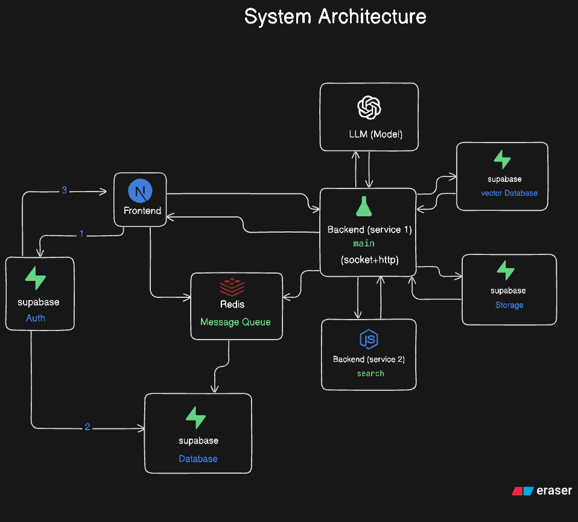
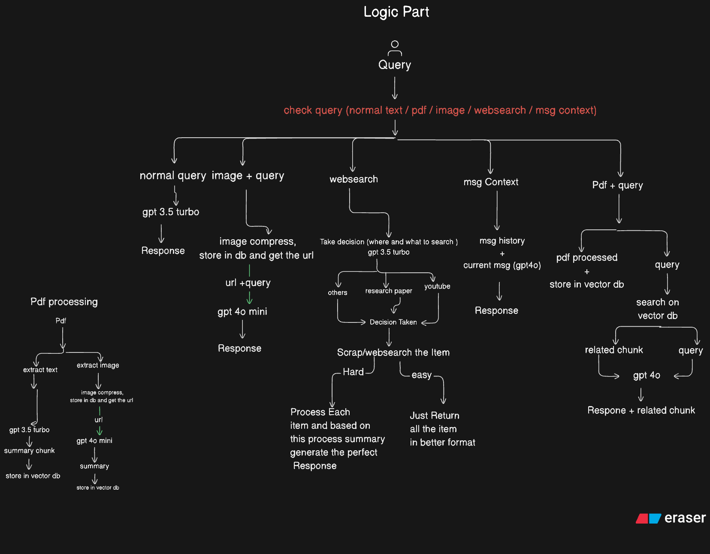
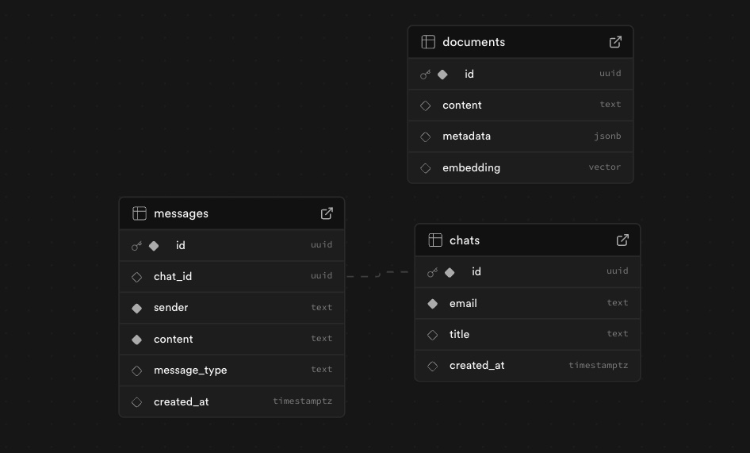
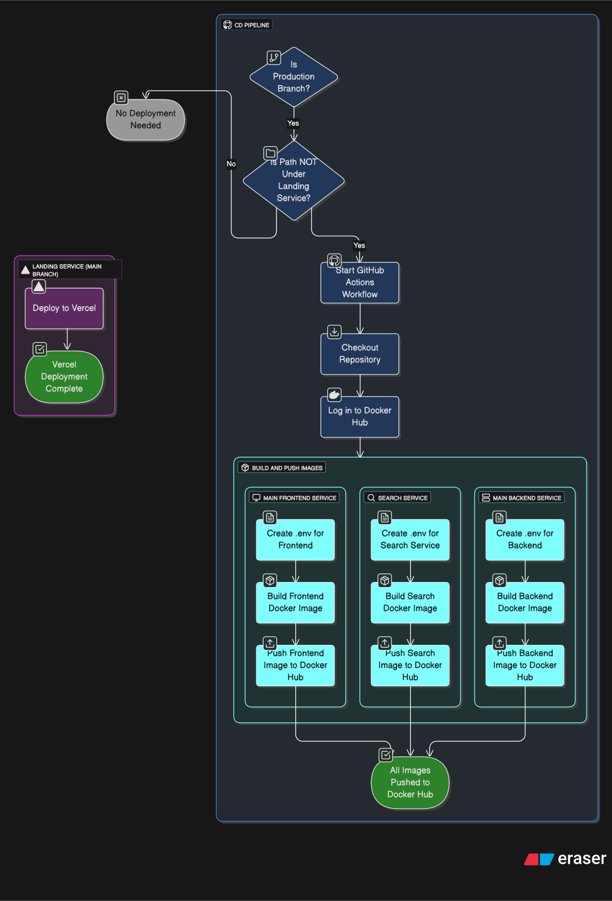

<div align="center">
  <h1>🚀🤖 OlyChat</h1>
  <h3>The Open-Source AI Platform for Modern Applications</h3>

  <p>
    <strong>OlyChat</strong> is an open-source repository designed to deliver advanced chat intelligence, custom chatbots, and autonomous agents in a complete AI toolkit.
  </p>

  <!-- Tech Stack Badges -->
  <p>
    
    
    
    
    
  </p>

  <p>
    <a href="#features"><strong>Features</strong></a> ·
    <a href="#system-architecture"><strong>Architecture</strong></a> ·
    <a href="#installation"><strong>Installation</strong></a> ·
    <a href="#deployment-strategy"><strong>Deployment</strong></a> ·
    <a href="#contact"><strong>Contact</strong></a>
  </p>
</div>

---

## ⚡ Features

- **📄 Advanced PDF Processing**: Accurately extracts text, images, tables, and charts to process them separately and provide the most relevant response.
- **🖼️ Deep Image Analysis**: Processes image details to provide context-aware responses based on user queries.
- **🌐 Smart Web Search**: Implements a custom decision mechanism that fetches results from YouTube videos, research papers, images, or news blogs based on the query context.
- **📂 File-Based Q&A**: Upload files and ask questions directly related to the file content.
- **🧠 Contextual Memory**: Remembers previous chat messages to generate responses that understand the ongoing conversation context.
- **⚡ Real-Time Performance**: Powered by **WebSockets** for faster responses and real-time processing status updates.
- **🚀 High-Performance Caching**: Uses **Redis** for message caching and low latency, with an optimized strategy for persisting data to the database.
- **✨ Clean Markdown Output**: Generates structured, accurate, and beautifully formatted Markdown responses.

---

## 🏗️ System Architecture

<div align="center">
  
</div>

### 🧠 Logic Flow

<div align="center">
  
</div>

---

## 💻 Installation

Follow these steps to set up the project locally using Docker.

<details>
  <summary><strong>Step 1: Install Docker</strong></summary>
  <ul>
    <li><a href="https://docs.docker.com/desktop/setup/install/windows-install/">Docker for Windows</a></li>
    <li><a href="https://docs.docker.com/desktop/setup/install/mac-install/">Docker for Mac</a></li>
    <li><a href="https://docs.docker.com/engine/install/ubuntu/">Docker for Ubuntu</a></li>
  </ul>
</details>

<details>
  <summary><strong>Step 2: Set Up Supabase</strong></summary>

  <h4>1️⃣ Create a Supabase Project</h4>
  <ol>
    <li>Log in to <a href="https://supabase.com" target="_blank">supabase.com</a>.</li>
    <li>Click <strong>“New Project”</strong>.</li>
    <li>Name: <code>olychat</code>.</li>
    <li>Region: Choose closest to you.</li>
    <li>Set a secure Database Password.</li>
  </ol>

  <h4>2️⃣ Get API Credentials</h4>
  <p>Go to <strong>Settings → API</strong> and copy:</p>
  <ul>
    <li><strong>Project URL</strong> (Use in `.env`)</li>
    <li><strong>anon public key</strong> (Use in `.env`)</li>
    <li><em>Note: Use the service_role key only in secure server-side environments.</em></li>
  </ul>
</details>

<details>
  <summary><strong>Step 3: Database Setup (SQL)</strong></summary>

  <h4>📐 ER Diagram</h4>
  

  <h4>Run the following SQL in the Supabase SQL Editor:</h4>

```sql
-- 1. Create Chats table
CREATE TABLE chats (
  id UUID PRIMARY KEY DEFAULT gen_random_uuid(),
  email TEXT NOT NULL,
  title TEXT null,
  created_at TIMESTAMP WITH TIME ZONE DEFAULT NOW()
);

-- 2. Create Messages table
CREATE TABLE messages (
  id UUID PRIMARY KEY DEFAULT gen_random_uuid(),
  chat_id UUID REFERENCES chats(id) ON DELETE CASCADE,
  sender TEXT NOT NULL,
  content TEXT NOT NULL,
  message_type TEXT DEFAULT 'text',
  created_at TIMESTAMP WITH TIME ZONE DEFAULT NOW()
);

-- 3. Create Vector Database Table & Function
create extension vector;

CREATE TABLE documents (
  id UUID PRIMARY KEY DEFAULT gen_random_uuid(),
  content TEXT,                         -- Document.page_content
  metadata JSONB,                       -- Document.metadata
  embedding VECTOR(1536)                -- for OpenAI embeddings
);

CREATE FUNCTION match_documents (
  query_embedding VECTOR(1536),
  match_count INT DEFAULT NULL,
  filter JSONB DEFAULT '{}'
)
RETURNS TABLE (
  id UUID,
  content TEXT,
  metadata JSONB,
  similarity FLOAT
)
LANGUAGE plpgsql
AS $$
BEGIN
  RETURN QUERY
  SELECT
    documents.id,
    documents.content,
    documents.metadata,
    1 - (documents.embedding <=> query_embedding) AS similarity
  FROM documents
  WHERE documents.metadata @> filter
  ORDER BY documents.embedding <=> query_embedding
  LIMIT match_count;
END;
$$;
```
</details>

<details>
  <summary><strong>Step 4: Configure Storage</strong></summary>
  <ol>
    <li>Go to <strong>Storage</strong> in the Supabase dashboard.</li>
    <li>Click <strong>“New bucket”</strong>.</li>
    <li>Name it <code>file-storage</code>.</li>
    <li>Set it to <strong>Public</strong>.</li>
  </ol>
  <p><em>Example URL format:</em> <code>https://your-project.supabase.co/storage/v1/object/public/file-storage/image.png</code></p>
</details>

<details>
  <summary><strong>Step 5: Local Environment Setup</strong></summary>

  <h4>📥 Clone Repository</h4>
  ```bash
  git clone https://github.com/Rakib-Hasan25/olychat.git
  cd olychat
  # Open in VS Code
  code . 
  ```

  <h4>🧪 Frontend Env (`main_frontend_service/.env`)</h4>
  ```env
  OPENAI_KEY="your_openai_key"
  REDIS_HOST=redis
  REDIS_PORT=6379
  NEXT_PUBLIC_SUPABASE_URL="your_supabase_project_url"
  NEXT_PUBLIC_SUPABASE_ANON_KEY="your_supabase_anon_key"
  NEXT_PUBLIC_MAIN_BACKEND_SERVICE_URL=http://localhost:5001
  MAIN_BACKEND_SERVICE_URL=http://main-backend-service:5001
  ```

  <h4>🔧 Backend Env (`main_backend_service/.env`)</h4>
  ```env
  OPENAI_API_KEY="your_openai_key"
  SUPABASE_URL="your_supabase_project_url"
  SUPABASE_SERVICE_KEY="your_supabase_anon_key"
  NODE_BACKEND_URL="http://search-service:3001"
  REDIS_HOST="redis"
  FLASK_APP=app.py 
  ```

  <h4>🔍 Search Service Env (`search_service/.env`)</h4>
  ```env
  SEARXNG_API_URL=http://searxng:8080
  ```

  <h4>▶️ Run with Docker</h4>
  ```bash
  docker compose up --build
  ```
</details>

---

## 🚀 Deployment Strategy

### Continuous Integration (CI)
<div align="center">
  
</div>

### Continuous Deployment (CD)
<div align="center">
  
</div>

### Docker Hub Images

| Service | Docker Image | Pull Command |
| :--- | :--- | :--- |
| **Frontend** | `rakibhasan25/olychat_main_frontend_service` | `docker pull rakibhasan25/olychat_main_frontend_service:latest` |
| **Backend** | `rakibhasan25/olychat_main_backend_service` | `docker pull rakibhasan25/olychat_main_backend_service:latest` |
| **Search** | `rakibhasan25/olychat_search_service` | `docker pull rakibhasan25/olychat_search_service:latest` |

---

## 🤝 Community & Contact

For questions, suggestions, or feedback, feel free to reach out to the community:

- **GitHub**: [Rakib Hasan](https://github.com/Rakib-Hasan25)
- **LinkedIn**: [Rakib Hasan](https://www.linkedin.com/in/rakib-hasan-cuet/)
- **YouTube**: [Code With Rakib](https://www.youtube.com/@CodewithRakibOfficial/)
- **Twitter**: [Rakib Hasan](https://x.com/hasanrakib65)
- **Website**: [codewithrakib.online](https://codewithrakib.online/)

---

## 🗾 Mission

Our mission is to make this repository a single, comprehensive resource that any AI chat application can reference. We aim to empower developers to build AI chatbots for their businesses and provide a centralized hub where all types of agent workflows are documented and maintained in one place.

<div align="center">
  <br />
  Happy Coding! 🚀
</div>
